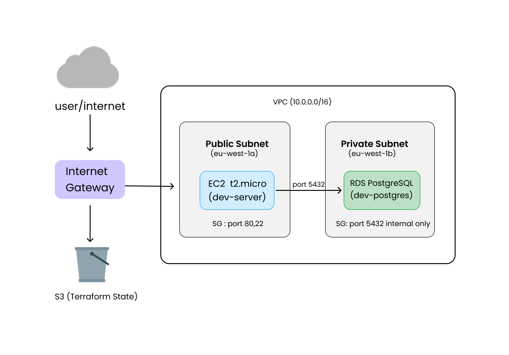

# Cloud Infrastructure with Terraform

Production-grade AWS infrastructure built with Terraform, featuring remote state management, modular architecture, and a CI/CD pipeline.

## Architecture

## Infrastructure Overview

- **VPC** — Isolated network with public and private subnets across 2 availability zones
- **EC2** — Web server in the public subnet with security group allowing HTTP and SSH
- **RDS** — PostgreSQL database in the private subnet, accessible only from within the VPC
- **S3 + DynamoDB** — Remote state storage with locking
- **GitHub Actions** — CI/CD pipeline that runs fmt, validate, and plan on every push

## Project Structure